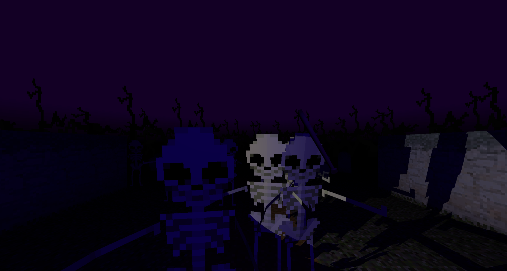

# Deathkeeper

You can play the latest version of the game at https://deathkeeper.sorskoot.com. 

# story
You are a gravekeeper on an old graveyard. Totaly nothing happens, ever. Until today. You've heard noises and rushed over to the graveyard. As you enter the graveyard, the dead are rising. You must kick their silly bones back to their graves!

Use your flashlight to better see what is going on and use your bat to shatter their bones. Make sure they don't get to you. 

- You start out at the entrance of the graveyard in Level 1. The skeletons are only approaching from the front. 
- But in Level 2 you are standing in a corner, and they start coming from 2 sides.
- In the third and final level they come from every directions... 

Good luck!

---

## js13kgames_2022

Deathkeeper won JS13kGames in 2022 (https://js13kgames.com/entries/deathkeeper). At that point the entire game fitted in a 13KB zipfile. The source as submitted will stay available at this branch: https://github.com/sorskoot/js13kgames_2022/tree/release/js13kgames-2022 

At some point in the future I probably rename the repository. 

